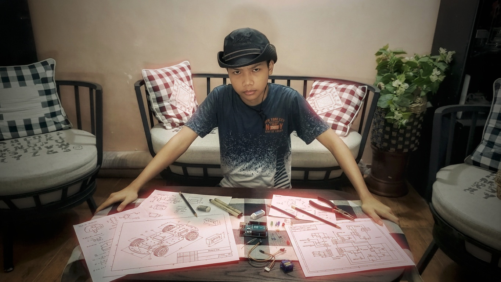

# 📘 PANDUAN BELAJAR HTML
### Mata Pelajaran: Rekayasa Perangkat Lunak (RPL)
### SMK Telkom Malang — Kelas XI TKJ 4
### Disusun berdasarkan file praktikum: `tabel.html`, `list.html`, `input.html`

---

## DAFTAR ISI

1. Apa itu HTML?
2. Struktur Dasar HTML
3. Tag Heading dan Paragraf
4. Gambar dan Hyperlink
5. List (Daftar) — Berurutan & Tidak Berurutan
6. Tabel HTML
7. Formulir (Form) dan Input
8. Ringkasan Tag-Tag Penting
9. Latihan Soal

---

---

# BAB 1: APA ITU HTML?

## Pengertian HTML

**HTML** (HyperText Markup Language) adalah bahasa **markup** standar yang digunakan untuk membuat halaman web. HTML bukan bahasa pemrograman, melainkan bahasa yang memberikan **struktur dan makna** pada konten web.

- **HyperText** → Teks yang bisa menghubungkan satu halaman ke halaman lain (hyperlink)
- **Markup** → Tanda/label yang memberitahu browser bagaimana menampilkan konten
- **Language** → Bahasa dengan aturan dan sintaks tersendiri

## Cara Kerja HTML

```
Kamu menulis kode HTML  →  Browser membacanya  →  Browser menampilkan halaman web
```

File HTML disimpan dengan ekstensi `.html` atau `.htm` dan dibuka menggunakan browser seperti Google Chrome, Firefox, atau Edge.

## Tools yang Dibutuhkan

| Tools | Fungsi |
|---|---|
| Text Editor (VS Code, Notepad++) | Menulis kode HTML |
| Browser (Chrome, Firefox) | Menampilkan hasil HTML |

---

---

# BAB 2: STRUKTUR DASAR HTML

## Kerangka Wajib HTML

Setiap file HTML **wajib** memiliki kerangka dasar berikut:

```html
<!DOCTYPE html>
<html lang="id">
<head>
    <meta charset="UTF-8">
    <meta name="viewport" content="width=device-width, initial-scale=1.0">
    <title>Judul Halaman</title>
</head>
<body>
    <!-- Konten halaman ditulis di sini -->
</body>
</html>
```

## Penjelasan Setiap Bagian

### `<!DOCTYPE html>`
- Deklarasi tipe dokumen, memberitahu browser bahwa ini adalah HTML versi 5 (HTML5)
- **Harus selalu ada di baris pertama**
- Bukan sebuah tag HTML, melainkan instruksi ke browser

### `<html lang="id">`
- Tag pembuka dokumen HTML
- Atribut `lang="id"` menandakan bahasa halaman adalah Bahasa Indonesia
- Semua konten HTML ditulis di antara `<html>` dan `</html>`

### `<head>`
- Bagian "kepala" dokumen — **tidak ditampilkan** di layar browser
- Berisi informasi/metadata tentang halaman
- Contoh isinya: `<title>`, `<meta>`, `<link>` (CSS), `<script>` (JavaScript)

### `<meta charset="UTF-8">`
- Mengatur **encoding karakter** agar huruf seperti: á, é, ñ, dan karakter khusus tampil dengan benar
- UTF-8 mendukung hampir semua karakter di dunia termasuk aksara lokal

### `<meta name="viewport" content="width=device-width, initial-scale=1.0">`
- Mengatur tampilan di perangkat mobile (HP, tablet)
- Membuat halaman **responsif** (menyesuaikan lebar layar)

### `<title>`
- Teks yang muncul di **tab browser**
- Penting untuk SEO (Search Engine Optimization)

### `<body>`
- Bagian "tubuh" dokumen — semua konten yang **terlihat di browser** ditulis di sini
- Termasuk: teks, gambar, tabel, formulir, link, dll.

## Contoh Nyata dari Praktikum

Berikut ini adalah struktur yang digunakan pada file **`list.html`** di project kamu:

```html
<!DOCTYPE html>
<html lang="id">
<head>
  <meta charset="UTF-8">
  <meta name="viewport" content="width=device-width, initial-scale=1.0">
  <title>Pemilihan Ekstra Kulikuler</title>
</head>
<body>
  <!-- Konten ditampilkan di sini -->
</body>
</html>
```

> ✅ **Catatan:** File `input.html` dan `tabel.html` di project belum memiliki tag `<head>` yang lengkap. Sebaiknya selalu sertakan `<head>` dengan `<meta charset>` dan `<title>` di setiap file HTML.

---

---

# BAB 3: TAG HEADING DAN PARAGRAF

## Tag Heading (Judul)

HTML memiliki 6 level heading, dari yang terbesar (`<h1>`) hingga terkecil (`<h6>`):

```html
<h1>Heading 1 — Paling Besar</h1>
<h2>Heading 2</h2>
<h3>Heading 3</h3>
<h4>Heading 4</h4>
<h5>Heading 5</h5>
<h6>Heading 6 — Paling Kecil</h6>
```

**Aturan penggunaan heading:**
- `<h1>` digunakan hanya **sekali** per halaman, sebagai judul utama
- `<h2>` untuk sub-judul
- `<h3>` untuk sub-sub-judul, dan seterusnya
- Jangan melompat tingkatan (misalnya langsung dari `<h1>` ke `<h4>`)

## Tag Paragraf

```html
<p>Ini adalah sebuah paragraf.</p>
<p>Ini adalah paragraf kedua. Browser akan otomatis menambahkan jarak antar paragraf.</p>
```

## Contoh Nyata dari Praktikum

Di file **`tabel.html`**, heading dan paragraf digunakan seperti ini:

```html
<h1>Hello My name is Ivan</h1>
<h3>Iam from SMK Telkom Malang</h3>
<p>This is my praktikum</p>
```

Di file **`list.html`**:

```html
<h1>Tahapan Pemilihan Ekstra Kulikuler</h1>
<p>Berikut langkah-langkah untuk memilih ekstrakurikuler yang tepat:</p>
```

Dan di file **`input.html`**:

```html
<h2>Formulir Pendaftaran</h2>
```

## Tag Teks Tambahan yang Sering Dipakai

| Tag | Fungsi | Contoh |
|---|---|---|
| `<b>` | Teks **tebal** | `<b>Tebal</b>` |
| `<i>` | Teks *miring* | `<i>Miring</i>` |
| `<u>` | Teks bergaris bawah | `<u>Garis bawah</u>` |
| `<br>` | Ganti baris (line break) | `Baris 1<br>Baris 2` |
| `<hr>` | Garis horizontal pemisah | `<hr>` |
| `<strong>` | Teks penting (tebal) | `<strong>Penting</strong>` |
| `<em>` | Teks penekanan (miring) | `<em>Penekanan</em>` |

## Tag `<hr>` — Garis Pemisah

Di file **`list.html`**, tag `<hr>` digunakan untuk memisahkan bagian:

```html
<p>Berikut langkah-langkah untuk memilih ekstrakurikuler yang tepat:</p>

<hr>

<ol>
  ...
</ol>

<hr>

<p>Contoh kriteria penilaian:</p>
```

---

---

# BAB 4: GAMBAR DAN HYPERLINK

## Tag Gambar ``

Tag `` digunakan untuk menampilkan gambar di halaman web. Tag ini **tidak memiliki tag penutup**.

```html

```

**Atribut penting ``:**

| Atribut | Wajib? | Fungsi |
|---|---|---|
| `src` | ✅ Ya | Path/URL gambar yang ditampilkan |
| `alt` | ✅ Ya | Teks alternatif jika gambar gagal dimuat (penting untuk aksesibilitas & SEO) |
| `width` | ❌ Tidak | Lebar gambar dalam piksel |
| `height` | ❌ Tidak | Tinggi gambar dalam piksel |
| `style` | ❌ Tidak | Gaya CSS langsung pada elemen |

## Contoh Nyata dari Praktikum

Di file **`tabel.html`**, gambar ditampilkan dengan gaya CSS inline:

```html
<div style="margin-top: 20px;">
    
</div>
```

**Penjelasan style yang digunakan:**
- `max-width: 100%` → Gambar tidak melebihi lebar container
- `height: auto` → Tinggi menyesuaikan otomatis (tidak terdistorsi)
- `border-radius: 8px` → Sudut gambar melengkung
- `box-shadow: ...` → Efek bayangan pada gambar

## Tag Hyperlink `<a>`

Tag `<a>` (anchor) digunakan untuk membuat tautan/link ke halaman lain.

```html
<a href="URL-tujuan">Teks yang bisa diklik</a>
```

**Atribut penting `<a>`:**

| Atribut | Fungsi |
|---|---|
| `href` | URL/alamat tujuan link |
| `target="_blank"` | Membuka link di **tab baru** |
| `target="_self"` | Membuka link di **tab yang sama** (default) |

## Contoh Nyata dari Praktikum

Di file **`tabel.html`**, hyperlink digunakan untuk membuka Instagram:

```html
<div style="margin-top: 20px;">
    <p>Kunjungi Instagram:</p>
    <a href="https://www.instagram.com/ivanarya.xyz" target="_blank">my Instagram account</a><br>
    <a href="https://www.instagram.com/smktelkommalang" target="_blank">Instagram SMK Telkom Malang</a>
</div>
```

- `target="_blank"` → Link membuka di tab baru agar pengguna tidak meninggalkan halaman
- `<br>` → Memberi jarak antar dua link

## Tag `<div>`

Tag `<div>` adalah **wadah/container** yang digunakan untuk mengelompokkan elemen-elemen HTML. `<div>` tidak memiliki tampilan visual sendiri, tapi bisa diberi gaya CSS.

```html
<div style="margin-top: 20px;">
    <!-- Konten di dalam div -->
</div>
```

`margin-top: 20px` → Memberi jarak 20 piksel di atas elemen.

---

---

# BAB 5: LIST (DAFTAR)

HTML menyediakan dua jenis daftar utama.

## 1. Ordered List `<ol>` — Daftar Berurutan

Menampilkan daftar dengan **nomor urut** (1, 2, 3, ...)

```html
<ol>
    <li>Item pertama</li>
    <li>Item kedua</li>
    <li>Item ketiga</li>
</ol>
```

**Hasil tampilan:**
1. Item pertama
2. Item kedua
3. Item ketiga

## 2. Unordered List `<ul>` — Daftar Tidak Berurutan

Menampilkan daftar dengan **simbol bullet** (•)

```html
<ul>
    <li>Item A</li>
    <li>Item B</li>
    <li>Item C</li>
</ul>
```

**Hasil tampilan:**
- Item A
- Item B
- Item C

## Tag `<li>` — List Item

Tag `<li>` digunakan di dalam `<ol>` maupun `<ul>` untuk setiap item dalam daftar.

## Contoh Nyata dari Praktikum

Ini adalah kode lengkap dari file **`list.html`**:

```html
<h1>Tahapan Pemilihan Ekstra Kulikuler</h1>

<p>Berikut langkah-langkah untuk memilih ekstrakurikuler yang tepat:</p>

<hr>

<!-- Daftar Berurutan (Ordered List) -->
<ol>
  <li>Kenali minat dan bakat.</li>
  <li>Pelajari daftar ekstrakurikuler yang tersedia.</li>
  <li>Pertimbangkan jadwal dan durasi kegiatan.</li>
  <li>Tanyakan pengalaman siswa lain atau pembimbing.</li>
  <li>Coba beberapa sesi awal sebelum memilih akhirnya.</li>
</ol>

<hr>

<p>Contoh kriteria penilaian:</p>

<!-- Daftar Tidak Berurutan (Unordered List) -->
<ul>
  <li>Minat pribadi</li>
  <li>Manfaat jangka panjang</li>
  <li>Kesesuaian jadwal sekolah</li>
  <li>Suasana dan lingkungan kelompok</li>
</ul>
```

**Analisis kode:**
- `<ol>` digunakan untuk **langkah-langkah** karena urutannya penting
- `<ul>` digunakan untuk **kriteria** karena urutannya tidak penting
- Terdapat 2 tag `<hr>` sebagai pemisah visual antar bagian

## Perbandingan `<ol>` vs `<ul>`

| | `<ol>` | `<ul>` |
|---|---|---|
| **Tampilan** | 1. 2. 3. | • • • |
| **Kapan digunakan** | Urutan penting (langkah-langkah, peringkat) | Urutan tidak penting (fitur, daftar acak) |
| **Contoh** | Resep masakan, tutorial | Daftar belanja, fitur produk |

---

---

# BAB 6: TABEL HTML

## Pengertian Tabel

Tabel digunakan untuk menampilkan data dalam **format baris dan kolom**, seperti spreadsheet.

## Tag-Tag Dasar Tabel

| Tag | Fungsi |
|---|---|
| `<table>` | Tag pembungkus utama tabel |
| `<tr>` | Table Row — satu baris tabel |
| `<th>` | Table Header — sel header (judul kolom, **tebal & rata tengah**) |
| `<td>` | Table Data — sel data biasa |

## Atribut Tabel yang Penting

| Atribut | Tempat | Fungsi |
|---|---|---|
| `border` | `<table>` | Menampilkan garis border (nilai: angka, contoh: `border="1"`) |
| `cellpadding` | `<table>` | Jarak antara isi sel dan batas sel (dalam piksel) |
| `cellspacing` | `<table>` | Jarak antar sel |
| `colspan` | `<th>` atau `<td>` | Menggabungkan beberapa **kolom** menjadi satu |
| `rowspan` | `<th>` atau `<td>` | Menggabungkan beberapa **baris** menjadi satu |

## Struktur Tabel Sederhana

```html
<table border="1" cellpadding="8" cellspacing="0">
    <tr>
        <th>Nama</th>
        <th>Nilai</th>
    </tr>
    <tr>
        <td>Ivan</td>
        <td>90</td>
    </tr>
    <tr>
        <td>Arya</td>
        <td>85</td>
    </tr>
</table>
```

## Contoh Nyata dari Praktikum — Tabel Nilai Siswa

File **`tabel.html`** menggunakan `rowspan` dan `colspan` untuk membuat tabel nilai yang lebih kompleks:

```html
<h3>Daftar Nilai Siswa</h3>
<table border="1" cellpadding="8" cellspacing="0">
    <tr>
        <th rowspan="2">No</th>
        <th rowspan="2">Nama Siswa</th>
        <th colspan="5">Mapel</th>
    </tr>
    <tr>
        <th>Matematika</th>
        <th>RPL</th>
        <th>Informatika</th>
        <th>Bahasa Indonesia</th>
        <th>Bahasa Inggris</th>
    </tr>
    <tr>
        <td>1</td>
        <td>Ivan</td>
        <td>90</td>
        <td>95</td>
        <td>88</td>
        <td>92</td>
        <td>89</td>
    </tr>
    <tr>
        <td>2</td>
        <td>Arya</td>
        <td>85</td>
        <td>92</td>
        <td>90</td>
        <td>87</td>
        <td>91</td>
    </tr>
    <!-- dst... -->
</table>
```

## Penjelasan `rowspan` dan `colspan`

### `rowspan="2"` pada kolom "No" dan "Nama Siswa"

```
+----+-----------+----------------------------------+
| No | Nama      |             Mapel               |  ← Baris 1
|    | Siswa     +----------+-----+-------+--------+  ← "No" dan "Nama Siswa"
|    |           | Matematika| RPL| Infor | dst... |  ← Baris 2    menempati 2 baris
+----+-----------+----------+-----+-------+--------+
```

- `rowspan="2"` → Sel tersebut **memanjang ke bawah** melewati 2 baris
- Sehingga di baris kedua (`<tr>` kedua), kita **tidak perlu** menulis `<th>` untuk "No" dan "Nama Siswa" lagi

### `colspan="5"` pada kolom "Mapel"

- `colspan="5"` → Sel "Mapel" **melebar ke kanan** melewati 5 kolom
- Sehingga satu teks "Mapel" akan mencakup lebar 5 kolom (Matematika, RPL, Informatika, Bahasa Indonesia, Bahasa Inggris)

## Juga Digunakan di `input.html`

File **`input.html`** menggunakan tabel dengan `border="0"` sebagai layout/tata letak formulir (tanpa garis):

```html
<table border="0" cellpadding="5">
    <tr>
        <td><label for="nama">Nama Lengkap</label></td>
        <td>:</td>
        <td><input type="text" id="nama" name="nama" placeholder="Nama Lengkap"></td>
    </tr>
    <!-- baris berikutnya... -->
</table>
```

> 💡 **Catatan:** Menggunakan tabel untuk layout formulir seperti ini adalah cara lama. Di praktik modern, layout menggunakan CSS Flexbox atau CSS Grid. Namun cara ini masih valid dan mudah dipahami untuk pemula.

---

---

# BAB 7: FORMULIR (FORM) DAN INPUT

## Pengertian Form HTML

Form (formulir) digunakan untuk **mengumpulkan data dari pengguna**, misalnya: formulir pendaftaran, login, survei, dll. Data yang diisi pengguna kemudian dikirim ke server.

## Struktur Dasar Form

```html
<form action="tujuan.php" method="post">
    <!-- Elemen-elemen input di sini -->
    <input type="submit" value="Kirim">
</form>
```

**Atribut `<form>`:**

| Atribut | Fungsi |
|---|---|
| `action` | URL/halaman tujuan pengiriman data |
| `method` | Metode pengiriman: `get` (data di URL) atau `post` (data tersembunyi) |

## Jenis-Jenis Input HTML

### `<input>` — Elemen Input Serbaguna

Tag `<input>` memiliki banyak tipe yang berbeda, ditentukan oleh atribut `type`:

### 1. `type="text"` — Input Teks Biasa

```html
<input type="text" id="nama" name="nama" placeholder="Nama Lengkap">
```
- Digunakan untuk teks satu baris
- `placeholder` → Teks petunjuk yang tampil sebelum diisi

### 2. `type="email"` — Input Email

```html
<input type="email" id="email" name="email" placeholder="Email">
```
- Browser otomatis memvalidasi format email (harus ada `@`)

### 3. `type="password"` — Input Password

```html
<input type="password" id="password" name="password" placeholder="Password">
```
- Karakter yang diketik akan **disembunyikan** (ditampilkan sebagai `●●●`)

### 4. `type="number"` — Input Angka

```html
<input type="number" id="umur" name="umur" placeholder="Umur">
```
- Hanya menerima angka
- Muncul tombol atas/bawah untuk menambah/mengurangi nilai

### 5. `type="date"` — Input Tanggal

```html
<input type="date" id="tgl" name="tanggal_lahir">
```
- Menampilkan **date picker** (kalender) untuk memilih tanggal

### 6. `type="radio"` — Pilihan Tunggal

```html
<input type="radio" id="jk-l" name="jenis_kelamin" value="laki-laki"> 
<label for="jk-l">Laki-laki</label>

<input type="radio" id="jk-p" name="jenis_kelamin" value="perempuan"> 
<label for="jk-p">Perempuan</label>
```
- Dari beberapa pilihan, **hanya satu** yang bisa dipilih
- Semua radio button dengan `name` yang sama akan saling terkait
- `value` → Nilai yang dikirim ke server saat form disubmit

### 7. `type="checkbox"` — Pilihan Banyak (Centang)

```html
<input type="checkbox" id="hobi-1" name="hobi" value="membaca"> 
<label for="hobi-1">Membaca</label>

<input type="checkbox" id="hobi-2" name="hobi" value="menulis"> 
<label for="hobi-2">Menulis</label>

<input type="checkbox" id="hobi-3" name="hobi" value="bermain"> 
<label for="hobi-3">Bermain</label>
```
- **Banyak** pilihan bisa dicentang sekaligus
- Cocok untuk input seperti: hobi, minat, preferensi

### 8. `type="file"` — Upload File

```html
<input type="file" id="foto" name="foto">
```
- Menampilkan tombol **"Choose File"** untuk memilih file dari perangkat

### 9. `type="submit"` — Tombol Kirim

```html
<input type="submit" value="Kirim">
```
- Menampilkan tombol untuk **mengirim data** form
- `value` → Teks yang muncul di tombol

## Elemen `<select>` — Dropdown / Pilihan Menu

```html
<select id="jurusan" name="jurusan">
    <option value="rpl">RPL</option>
    <option value="tkj">TKJ</option>
    <option value="mm">MM</option>
</select>
```
- Menampilkan daftar pilihan dalam bentuk **dropdown menu**
- `<select>` = wadah menu dropdown
- `<option>` = setiap pilihan di dalam dropdown
- Atribut `value` pada `<option>` = nilai yang dikirim ke server

## Tag `<label>` dan Atribut `for`

```html
<label for="nama">Nama Lengkap</label>
<input type="text" id="nama" name="nama">
```

- `<label>` memberikan **deskripsi/keterangan** untuk sebuah input
- Atribut `for` pada label harus sama dengan atribut `id` pada input
- Manfaat: Saat label diklik, fokus akan berpindah ke input yang terkait
- Penting untuk **aksesibilitas** (pengguna dengan screen reader)

## Kode Lengkap Praktikum — `input.html`

```html
<!DOCTYPE html>
<html>
<body>
    <h2>Formulir Pendaftaran</h2>
    <form>
        <table border="0" cellpadding="5">
            <tr>
                <td><label for="nama">Nama Lengkap</label></td>
                <td>:</td>
                <td><input type="text" id="nama" name="nama" placeholder="Nama Lengkap"></td>
            </tr>
            <tr>
                <td><label for="email">Email</label></td>
                <td>:</td>
                <td><input type="email" id="email" name="email" placeholder="Email"></td>
            </tr>
            <tr>
                <td><label for="password">Password</label></td>
                <td>:</td>
                <td><input type="password" id="password" name="password" placeholder="Password"></td>
            </tr>
            <tr>
                <td><label for="umur">Umur</label></td>
                <td>:</td>
                <td><input type="number" id="umur" name="umur" placeholder="Umur"></td>
            </tr>
            <tr>
                <td><label for="tgl">Tanggal Lahir</label></td>
                <td>:</td>
                <td><input type="date" id="tgl" name="tanggal_lahir"></td>
            </tr>
            <tr>
                <td>Jenis Kelamin</td>
                <td>:</td>
                <td>
                    <input type="radio" id="jk-l" name="jenis_kelamin" value="laki-laki"> 
                    <label for="jk-l">Laki-laki</label>
                    <input type="radio" id="jk-p" name="jenis_kelamin" value="perempuan"> 
                    <label for="jk-p">Perempuan</label>
                </td>
            </tr>
            <tr>
                <td>Hobi</td>
                <td>:</td>
                <td>
                    <input type="checkbox" id="hobi-1" name="hobi" value="membaca"> 
                    <label for="hobi-1">Membaca</label>
                    <input type="checkbox" id="hobi-2" name="hobi" value="menulis"> 
                    <label for="hobi-2">Menulis</label>
                    <input type="checkbox" id="hobi-3" name="hobi" value="bermain"> 
                    <label for="hobi-3">Bermain</label>
                </td>
            </tr>
            <tr>
                <td><label for="jurusan">Jurusan</label></td>
                <td>:</td>
                <td>
                    <select id="jurusan" name="jurusan">
                        <option value="rpl">RPL</option>
                        <option value="tkj">TKJ</option>
                        <option value="mm">MM</option>
                    </select>
                </td>
            </tr>
            <tr>
                <td><label for="foto">Foto Profil</label></td>
                <td>:</td>
                <td><input type="file" id="foto" name="foto"></td>
            </tr>
            <tr>
                <td></td>
                <td></td>
                <td><input type="submit" value="Kirim"></td>
            </tr>
        </table>
    </form>
</body>
</html>
```

---

---

# BAB 8: RINGKASAN TAG-TAG PENTING

## Tag Struktur Dokumen

| Tag | Fungsi |
|---|---|
| `<!DOCTYPE html>` | Deklarasi tipe dokumen HTML5 |
| `<html>` | Elemen root seluruh dokumen HTML |
| `<head>` | Metadata dokumen (tidak terlihat di browser) |
| `<body>` | Konten halaman yang terlihat |
| `<title>` | Judul halaman (di tab browser) |
| `<meta>` | Metadata (charset, viewport, deskripsi) |

## Tag Teks & Heading

| Tag | Fungsi |
|---|---|
| `<h1>` s/d `<h6>` | Heading / judul (h1 terbesar) |
| `<p>` | Paragraf |
| `<br>` | Ganti baris |
| `<hr>` | Garis horizontal |
| `<b>` / `<strong>` | Teks tebal |
| `<i>` / `<em>` | Teks miring |
| `<u>` | Teks bergaris bawah |

## Tag Konten

| Tag | Fungsi |
|---|---|
| `` | Menampilkan gambar |
| `<a>` | Hyperlink / tautan |
| `<div>` | Wadah/container blok |
| `<span>` | Wadah/container inline |

## Tag List

| Tag | Fungsi |
|---|---|
| `<ul>` | Unordered list (bullet) |
| `<ol>` | Ordered list (angka) |
| `<li>` | Item dalam list |

## Tag Tabel

| Tag | Fungsi |
|---|---|
| `<table>` | Elemen tabel |
| `<tr>` | Baris tabel |
| `<th>` | Header sel tabel (tebal, rata tengah) |
| `<td>` | Sel data tabel |

## Tag Form & Input

| Tag | Fungsi |
|---|---|
| `<form>` | Wadah formulir |
| `<input>` | Elemen input serbaguna |
| `<label>` | Label/keterangan untuk input |
| `<select>` | Dropdown menu |
| `<option>` | Pilihan dalam dropdown |
| `<textarea>` | Area teks multi-baris |
| `<button>` | Tombol |

## Jenis `type` pada `<input>`

| `type` | Tampilan |
|---|---|
| `text` | Kotak teks satu baris |
| `email` | Kotak teks khusus email |
| `password` | Kotak teks tersembunyi |
| `number` | Kotak angka |
| `date` | Pemilih tanggal (kalender) |
| `radio` | Tombol pilihan tunggal (○) |
| `checkbox` | Kotak centang (☐) |
| `file` | Tombol unggah file |
| `submit` | Tombol kirim form |
| `reset` | Tombol reset form |

---

---

# BAB 9: LATIHAN SOAL

## Soal Pilihan Ganda

**1.** Kepanjangan dari HTML adalah...
   - a) HyperText Markup Language ✅
   - b) High Transfer Markup Language
   - c) HyperText Making Language
   - d) Huge Text Markup Language

**2.** Tag mana yang digunakan untuk membuat daftar berurutan (bernomor)?
   - a) `<ul>`
   - b) `<li>`
   - c) `<ol>` ✅
   - d) `<dl>`

**3.** Atribut apakah yang digunakan pada tag `<a>` untuk membuka link di tab baru?
   - a) `href="_blank"`
   - b) `target="_blank"` ✅
   - c) `open="newtab"`
   - d) `link="_blank"`

**4.** Jika kita ingin sebuah sel tabel menggabungkan 3 kolom menjadi satu, atribut mana yang digunakan?
   - a) `rowspan="3"`
   - b) `merge="3"`
   - c) `colspan="3"` ✅
   - d) `colgroup="3"`

**5.** Input jenis apakah yang cocok digunakan untuk memilih satu pilihan dari beberapa opsi yang tersedia?
   - a) `type="checkbox"`
   - b) `type="radio"` ✅
   - c) `type="select"`
   - d) `type="option"`

## Soal Esai / Praktik

**1.** Buatlah halaman HTML yang menampilkan biodata dirimu sendiri, meliputi:
   - Nama (menggunakan `<h1>`)
   - Asal sekolah (menggunakan `<h3>`)
   - Foto dirimu (menggunakan ``)
   - Daftar hobi (menggunakan `<ul>`)

**2.** Buatlah tabel daftar nilai 5 matapelajaran untuk 3 siswa, lengkap dengan header menggunakan `<th>` dan data menggunakan `<td>`.

**3.** Lengkapi formulir **`input.html`** di praktikum dengan menambahkan:
   - Field untuk nomor telepon (`type="tel"`)
   - Field untuk alamat (gunakan `<textarea>`)
   - Tambahkan atribut `required` pada field wajib diisi

---

---

> 📝 **Disusun berdasarkan file praktikum:**
> - [`tabel.html`](tabel.html) — Praktikum heading, gambar, hyperlink, dan tabel nilai
> - [`list.html`](list.html) — Praktikum ordered list dan unordered list
> - [`input.html`](input.html) — Praktikum form dan berbagai jenis input HTML
>
> **SMK Telkom Malang | Kelas XI TKJ 4 | Mata Pelajaran RPL**
